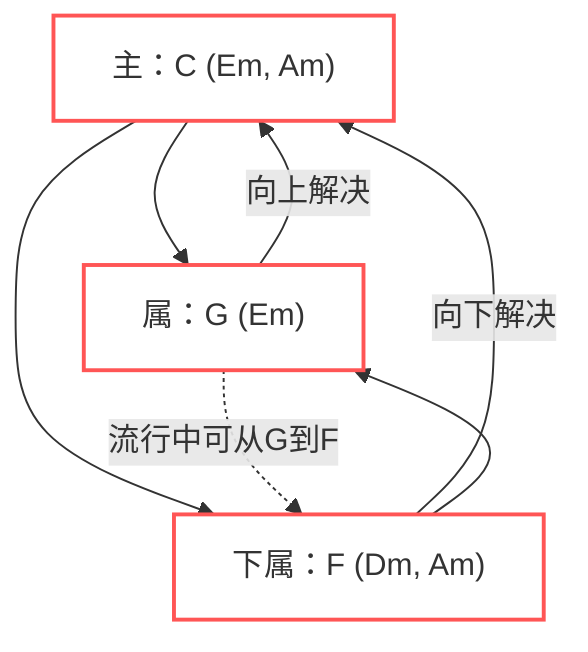

# 三和弦
所谓三和弦,就是按照三度关系堆叠三个音.
直接进行一个排列组合:

| 和弦音程 | 构成举例 | 名称 | 标记写法举例 |
|:---------:|:---------:|:------:|:------------:|
| 大三度+小三度 | $C E G$ | 大三 | $C / Cmaj / C M / C _{△} $ |
| 小三度+大三度 | $C E \flat  G$ | 小三 | $Cmin / Cm / C- $|
| 大三度+大三度 | $C E G \sharp $ | 增三 | $Caug / C+ / CM ^{\sharp5}  / C_{△} ^{\sharp5} $|
| 小三度+小三度 | $C E\flat  G\flat $ | 减三 | $Cdim / C° / Cm ^{\flat5}  / {C-} ^{\flat5} $ |

对于大调:

| 音级位置 | 1级 | 2级 | 3级 | 4级 | 5级 | 6级 | 7级 |
|---------|----|----|----|----|----|----|----|
| 根音 | 1 | 2 | 3 | 4 | 5 | 6 | 7 |
| 三音 | 3 | 4 | 5 | 6 | 7 | 1 | 2 |
| 五音 | 5 | 6 | 7 | 1 | 2 | 3 | 4 |
| 和弦符号 | $C$ | $Dm$ | $Em$ | $F$ |$ G$ | $Am$ | $Bdim$ |
| 属性 | **主** | 上主 | 中 | **下属** | **属** | 下中 | 导 |

可以发现,136级,24级,57级和弦都有两个共同音,会导致它们的听感有一定相似性.
所以按照以上规律可以进行归类:

| 功能和声类别 | 主要和弦 | 相关小和弦 |
|------------|---------|-----------|
| **主**     | $C    $   | $Em, Am$    |
| **属**     | $G $      | $Bdim $       |
| **下属**   | $F$       | $Dm, Am$    |

它们之间的进行关系可以总结为如下图,还有一些tips:

·如果以主要和弦起,那么并不一定要马上进行转换,可以先转换到小和弦中,再进行下一步的转换(如1645进行).

·除主和弦外,所有的和弦均有不稳定因素,而不稳定到稳定的过程称之为 **解决**.常见的解决方法是保持主和弦相同音,其他音按照同向两度方法解决($G - C$).但如果没有相同音,可以解决到省略五音的主和弦($Dm - C$).

